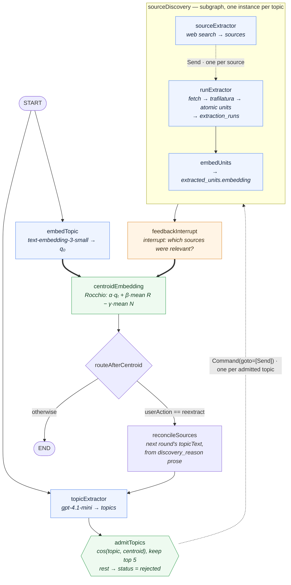
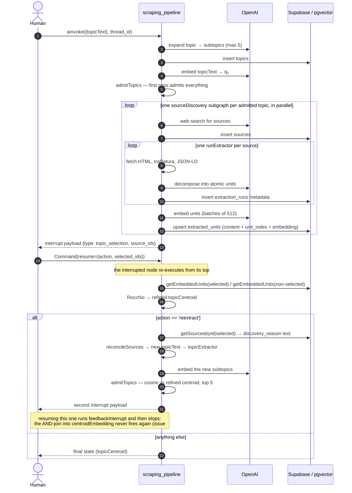
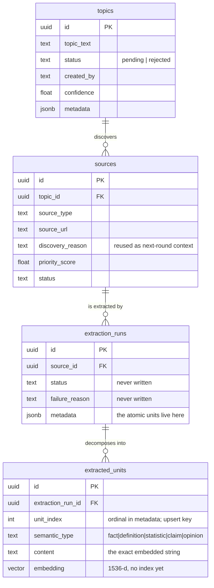

# YouTubeExtraction

> A research **knowledge-extraction pipeline** on **LangGraph + Supabase/pgvector**.
> One research topic goes in; subtopics, web sources, atomic factual units and their
> embeddings come out — with a human-in-the-loop step that refines the topic vector by
> **Rocchio relevance feedback**, and an **admission gate** that uses the refined vector
> to decide which subtopics get researched next.

The name is historical: the repo began as a multithreaded YouTube scraper (still here,
see [Legacy](#legacy-the-youtube-scraper)), but the active project is the LangGraph
pipeline under `src/app/`.

**Status: work in progress.** The pipeline is wired end to end and its maths is tested,
but one structural bug caps the feedback loop at a single round and several paths are
broken in ways worth knowing before you spend tokens on them. They are listed in
[Known issues](#known-issues) — each verified against the code at `5d7ac8b`, several by
replaying `graph.py`'s exact wiring with stub node bodies, not inferred from reading.

---

## Contents

1. [What it does](#what-it-does)
2. [The graph](#the-graph)
3. [A round, step by step](#a-round-step-by-step)
4. [State contract](#state-contract)
5. [Data model](#data-model)
6. [Repository layout](#repository-layout)
7. [Setup](#setup)
8. [Running](#running)
9. [Testing](#testing)
10. [Known issues](#known-issues)
11. [Roadmap](#roadmap)
12. [Legacy: the YouTube scraper](#legacy-the-youtube-scraper)

---

## What it does

Given `topicText`, one round of the pipeline:

1. **Expands** the topic into independently researchable subtopics (`gpt-4.1-mini`, JSON
   output, prompt-capped at 5) and writes them to `topics`.
2. **Embeds** the original topic text into `topicCentroid` (`text-embedding-3-small`,
   1536-d) — the query vector `q₀`.
3. **Admits** subtopics through the gate. On the first pass everything is admitted; on a
   re-extract round each candidate subtopic is embedded, cosine-scored against the
   current centroid, and only the top 5 survive — the rest are marked
   `topics.status = 'rejected'`. This is the one place the refined centroid is read.
4. **Discovers** 5–10 web sources *per admitted subtopic* with a web-search-enabled chat
   model, writing `sources` rows with a `discovery_reason` and a `priority_score`.
5. **Fetches** each source (`curl_cffi` impersonating Chrome, SeleniumBase fallback,
   non-HTML and PDF responses skipped), extracts readable text with `trafilatura` plus
   any JSON-LD, and **decomposes** it into *atomic units* — one self-contained fact,
   definition, statistic, claim or opinion each — stored as JSON in
   `extraction_runs.metadata`.
6. **Embeds** every unit (batches of 512, retried with exponential backoff) into
   `extracted_units`, each row carrying the exact string it was computed from
   (`content`) and its ordinal (`unit_index`), upserted on
   `(extraction_run_id, unit_index)` so re-embedding a run overwrites rather than
   duplicates.
7. **Pauses** at a LangGraph `interrupt()` and asks a human which sources were relevant.
8. **Refines** the topic vector from that judgement:
   `qₜ₊₁ = norm(α·qₜ + β·mean(relevant) − γ·mean(non-relevant))`, with
   `α=1.0, β=0.75, γ=0.15`. Note `qₜ`, not `q₀`: on a re-extract round the input is
   the *previous round's refined centroid*, because `topicEmbed` returns early on
   `reextract` rather than re-embedding the rebuilt `topicText`. The loop is iterative
   Rocchio. (`TransformationService.compute_query_vector` names the parameter `q0`,
   which is accurate only on the first round.)
9. Either **ends**, or loops back through `reconcileSources` for another round.

Two things it does *not* do yet: retrieve anything by vector similarity over the units
it embedded ([#7](#retrieval)), and survive a second trip round the loop
([#1](#the-loop)).

---

## The graph

`langgraph.json` exposes one graph, `scraping_pipeline`
(`src.app.graph.graph:graph`). Solid arrows are edges; dashed arrows are `Send()`
fan-outs, which run one instance of the target per item.



Three things the picture is hiding:

- **The two bold edges into `centroidEmbedding` are one statement** —
  `add_edge(["embedTopic", "feedbackInterrupt"], "centroidEmbedding")`, an **AND-join**
  that fires only when *both* predecessors have written. `embedTopic` is reachable only
  from `START`, so it writes exactly once, and the join can never be satisfied a second
  time. That is [Known issue #1](#the-loop), and it is why the loop runs once.
- **The gate fans out with a `Command`, not a conditional edge.** `admissionGate`
  returns `Command(update={"topicIds": Overwrite(admitted)}, goto=[Send(...)])`, so the
  admitted list is both the fan-out and the new value of the channel. The older
  `fan_out_sources` helper at the top of `graph.py` is now dead code.
- **The graph compiles without a checkpointer** (`builder.compile(name="scrapingPipeline")`),
  and `interrupt()` requires one — see [Running](#running).

### Node → service → model → table

| Stage | Node (graph id) | Service | Model / tool | Writes |
| --- | --- | --- | --- | --- |
| Topic expansion | `topicExtractor` | `topicExtractionService` | `gpt-4.1-mini` + `JsonOutputParser` | `topics` |
| Topic embedding | `embedTopic` | *(inline `AsyncOpenAI`)* | `text-embedding-3-small` | → `topicCentroid` |
| Admission gate | `admitTopics` | *(inline; `getTopicsMetadata` / `rejectTopics`)* | `text-embedding-3-small` + cosine | `topics.status`, → `topicIds` |
| Source discovery | `sourceExtractor` | `sourceDiscoveryService` | chat model + `web_search_preview` tool | `sources` |
| Content extraction | `runExtractor` | `extractionService` | `curl_cffi` → SeleniumBase, `trafilatura`, `gpt-4.1-mini` structured output | `extraction_runs` |
| Unit embedding | `embedUnits` | `embeddingService` | `text-embedding-3-small`, batches of 512 | `extracted_units` |
| Human feedback | `feedbackInterrupt` | *(LangGraph `interrupt`)* | — | → `selectedSourceIds` / `nonselectedSourceIds` |
| Centroid refinement | `centroidEmbedding` | `TransformationService` | Rocchio over `getEmbeddedUnits`; `qₜ` is the running centroid | → `topicCentroid` |
| Routing | `routeAfterCentroid` | — | — | `Command(goto=…)` |
| Re-seed | `reconcileSources` | — | `getSourcesbyId` | → `topicText` |

---

## A round, step by step



---

## State contract

`src/app/graph/state.py`. The `Annotated[..., operator.add]` channels are **append-only
reducers**: assigning `[]` to one appends nothing rather than clearing it. Both the
router and the gate therefore wrap their resets in LangGraph's `Overwrite` sentinel,
which is what makes each round start clean.

| Channel | Type | Written by |
| --- | --- | --- |
| `topicText` | `str` | caller, then `reconcileSources` |
| `topicCentroid` | `list[float]` (1536) | `embedTopic` (round 1 only — it returns early on `reextract`), then `centroidEmbedding` each round |
| `topicIds` | `Annotated[list[str], operator.add]` | `topicExtractor` (append), `admissionGate` (`Overwrite`), `routeAfterCentroid` (`Overwrite([])`) |
| `sourceIds` | `Annotated[list[str], operator.add]` | `embedUnits` via the subgraph's output schema; reset by `routeAfterCentroid` (`Overwrite([])`) |
| `userAction` | `str` | `interruptSelections` |
| `selectedSourceIds` / `nonselectedSourceIds` | `list[str] \| None` | `interruptSelections` |

The subgraph runs on `sourceDiscoveryState`, whose `extraction_run_ids` channel is also
`operator.add` — that is how the fanned-out `runExtractor` instances hand their run ids
to a single `embedUnits`.

---

## Data model

Four tables, `supabase/migrations/`:



Three things to know about this schema:

- **Units live in two places.** `extraction_runs.metadata` holds them as JSON (the
  extractor's output); `extracted_units` holds one row per unit once embedded.
  `unit_index` is the join between them — the unit's ordinal in the metadata array —
  and `(extraction_run_id, unit_index)` is the upsert key added by
  `20260831101500_unit_content_alignment.sql`.
- **`content` is the exact string that was embedded.** Rows written before that
  migration have `content = null` and cannot be backfilled (their ordinal is
  unrecoverable — the whole batch shares one `created_at`). Run
  `delete from extracted_units where content is null;` and re-embed.
- **`extraction_runs` has no `topic_id` column**, but `createExtractions` writes one.
  See [#5](#extraction).

---

## Repository layout

```
src/app/
  graph/
    graph.py                     the top-level StateGraph
    state.py                     GlobalState / sourceDiscoveryState / TopicState
    subgraphs/sourceDiscovery.py the per-topic map-reduce subgraph
    nodes/                       one file per node (thin: resolve repo, call service)
      admissionGate.py           the one node that reads the centroid back
  services/                      all I/O and model calls
    topicExtractionService.py    topic → subtopics
    sourceDiscoveryService.py    subtopic → web sources
    extractionService.py         URL → HTML → readable text → atomic units
    embeddingServices.py         units → vectors → extracted_units
    transformationService.py     Rocchio
  prompts/transformation.py      the atomic-unit decomposition prompt
src/agent/webapp.py              FastAPI app; its lifespan initialises the repo
db/
  supabaseRepository.py          every query in the project
  session.py                     module-level repo singleton (init_repo/get_repo)
supabase/migrations/             schema
tests/                           unit / node / integration
ScrapeRun.py, exec/, utils/, logs/   legacy YouTube scraper
ROADMAP.md                       a spec for a `Graph.md` doc (see Roadmap)
```

The layering is consistent and worth preserving: **nodes stay thin** (resolve the repo,
call a service, return a partial state update); **services own all I/O**;
**`db/supabaseRepository.py` owns all SQL**. Every service takes its repo by constructor
injection, which is what makes the tests mock-friendly. `admissionGate` is the exception
— it embeds, scores and calls the repository inline, with no service behind it.

---

## Setup

### Prerequisites

- **Python 3.13** (`pyproject.toml` requires `>=3.13`; the legacy `Makefile` still says
  3.12)
- [**uv**](https://docs.astral.sh/uv/)
- [**Supabase CLI**](https://supabase.com/docs/guides/local-development) + Docker
- An **OpenAI API key**
- Chrome/ChromeDriver only for the browser fetch tier or the legacy scraper

### 1. Dependencies

```bash
uv sync
```

`requirements.txt` is **legacy-scraper only** — no langgraph, openai, supabase or
trafilatura. Do not install from it.

### 2. Local Supabase

```bash
supabase start          # Postgres + PostgREST on 127.0.0.1:54321
supabase db reset       # applies supabase/migrations/
```

### 3. Environment

`langgraph.json` loads `.env.local`:

```bash
# .env.local
OPENAI_API_KEY=sk-...
```

The Supabase URL and service key are **hardcoded** in `db/supabaseRepository.py:17-18`
rather than read from the environment ([#12](#configuration--tooling)).

---

## Running

```bash
uv run langgraph dev
```

Then use LangGraph Studio, or the SDK against `http://127.0.0.1:2024`.

> **The graph cannot be driven from a bare script.** Two runtime dependencies come from
> the server, not the module:
>
> - `builder.compile(name="scrapingPipeline")` is compiled **without a checkpointer**,
>   and `interrupt()` requires one. A plain `graph.ainvoke()` cannot complete a round.
> - The repository singleton is initialised by the FastAPI lifespan
>   (`src/agent/webapp.py` → `init_repo()`), which `langgraph.json` mounts as its
>   `http.app`. Without it the first node to touch the database raises
>   `RuntimeError: Repo not initialized — did lifespan run?`
>
> Every run also needs a `thread_id` in `config.configurable`.

### The human-in-the-loop interrupt

The first invocation runs until `feedbackInterrupt` and returns:

```json
{"type": "topic_selection", "source_ids": ["<uuid>", "..."]}
```

Resume with a **dict** (or a JSON string that parses to one) carrying *both* keys — a
payload missing either raises `KeyError` from inside the node, which surfaces as a
graph-execution error rather than a re-prompt:

```python
from langgraph.types import Command

await client.runs.wait(
    thread_id, "scraping_pipeline",
    command=Command(resume={"action": "reextract", "selected_ids": ["<uuid>"]}),
)
```

- `action == "reextract"` → the centroid is refined, `reconcileSources` rebuilds
  `topicText` from the selected sources' `discovery_reason` prose, and the run continues
  into a second round, pausing at a second `topic_selection` interrupt.
- any other value → the run ends and `topicCentroid` holds the refined vector.

Answering the **second** interrupt currently does nothing: the run stops there
([#1](#the-loop)). Treat one refinement per thread as the working limit.

Note that the node containing `interrupt()` **re-executes from its first line** on
resume; keep side effects out of anything above the `interrupt()` call.

---

## Testing

```bash
uv run pytest tests/
```

If collection dies with a `pkg_resources` `ImportError`, that is seleniumbase's pytest
plugin (a legacy-scraper dependency) meeting `setuptools>=82`, which removed
`pkg_resources`. Disable the plugins:

```bash
uv run pytest tests/ -p no:seleniumbase -p no:sb_pytest -p no:html
```

### Current state of the suite

Measured at `5d7ac8b` in a minimal environment (pytest, pytest-asyncio, langgraph,
numpy, openai, supabase): **18 passed, 10 failed**.

| Suite | State |
| --- | --- |
| `tests/unit/test_transformation_service.py` | ✅ Rocchio maths: α/β/γ terms, normalisation, zero-vector guard, list output, and `compute_query_vector`'s fetch behaviour. |
| `tests/unit/test_embed_service.py` | ✅ Each vector is stored with the text it came from; the pairing survives an out-of-order `resp.data`; `unit_index` counts across batches; a short response raises instead of misaligning. |
| `tests/unit/test_get_embedded_units.py` | ✅ The `extracted_units ⋈ extraction_runs` filter, the JSON→list embedding decode, and the vector→text round trip. |
| `tests/node/test_centroid_embedding.py` | ✅ Repo + service wiring and the refined centroid written back to state. |
| `tests/node/test_embed_units.py` | ❌ **Stale (5 failures).** Asserts the old `{"embedded_count": n}` contract; the node now returns the whole mutated state and reads `state["source_ids"]`, so the empty-input case raises `KeyError`. |
| `tests/node/test_interrupt_selections.py` | ❌ **Stale (4 failures).** Calls the now-`async` node without awaiting it, and expects the old comma-separated-string resume contract instead of `{"action", "selected_ids"}`. |
| `tests/integration/test_feedback_loop.py` | ❌ **Stale (1 failure).** Resumes with `"s1, s3"`; the node now `json.loads`es a string resume, so it raises `JSONDecodeError`. |
| `tests/node/test_topic_embed.py` | ⚠️ Only collectible with the full dependency set: `topicEmbed` imports an unused `MODEL` from `extractionService`, which drags trafilatura/seleniumbase into the import graph. |
| `tests/integration/test_topicExtractor.py` | ❌ Passes `llm=None` to a constructor that does not accept it, asserts `result is List[str]`, and needs a live local Supabase. |
| `tests/execdata.py` | Legacy scraper smoke test; launches a real browser. |

**`admissionGate` has no tests at all** — no coverage of the first-pass passthrough, the
cosine ranking, the top-5 cut, or the rejection write. It is the newest node and the one
holding the only read of the centroid.

The three stale suites are stale in an informative way: each documents the contract a
node *used* to have. Fixing them means first deciding what the contract *should* be —
see [#4](#node-contracts).

---

## Known issues

Verified against the code at `5d7ac8b`. Items #1–#3 were confirmed by replaying
`graph.py`'s exact wiring — same nodes, same edges, stub bodies — under a `MemorySaver`
and streaming the node updates.

### The loop

<a id="the-loop"></a>
**1. The loop can only run once; the second round's feedback is silently discarded.**
`add_edge(["embedTopic", "feedbackInterrupt"], "centroidEmbedding")` compiles to a
barrier that fires only when *every* named node has written. `embedTopic` is reachable
only from `START`, so it writes exactly once. On the second cycle `feedbackInterrupt`
writes, the barrier stays half-filled, and `centroidEmbedding` — and therefore
`routeAfterCentroid` — never runs again. Observed trace of a two-round run:

```
embedTopic → topicExtractor(1) → admitTopics → sourceDiscovery ×5 → feedbackInterrupt
  ↳ resume(reextract) → centroidEmbedding → routeAfterCentroid → reconcileSources
    → topicExtractor(2) → admitTopics → sourceDiscovery ×5 → feedbackInterrupt
      ↳ resume(reextract) → (nothing; state.next == ())
```

So there is exactly one Rocchio refinement per thread (`q₀` is the only vector Rocchio
ever sees), and the admission gate is starved with it — round 2's gate ranks against the
once-refined centroid, and round 3's subtopics would be the first it could rank against a
twice-refined one.

**What the loop is meant to do.** `topicEmbed`'s
`if state.get('userAction') == 'reextract': return state` guard is unreachable today for
the same reason, but it is the load-bearing piece of the intended design: it stops the
rebuilt `topicText` from being re-embedded over the refined vector, so round `t+1` feeds
Rocchio the **previous round's refined centroid** rather than a fresh `q₀`. The loop is
iterative Rocchio, `qₜ₊₁ = norm(α·qₜ + β·mean(Rₜ) − γ·mean(Nₜ))`.

*Fix:* either works, and both were verified against the real node bodies with only the
leaf services faked:

| Wiring | Rocchio runs over 4 invocations | `qₜ` handed to Rocchio |
| --- | --- | --- |
| as built | **1** — `next=()` after the second interrupt | `[q₀]` |
| **A** — drop the join: `feedbackInterrupt → centroidEmbedding` | 3 | `q₀ → q₁ → q₂` |
| **B** — put `embedTopic` in the cycle: `reconcileSources → embedTopic → topicExtractor` | 3 | `q₀ → q₁ → q₂` |

A is one line and makes `centroidEmbedding` depend on the channel it already reads
(`topicCentroid` lives in state). B keeps the join honest and makes the guard do real
work; it does not duplicate `topicIds`, because `routeAfterCentroid` has already
`Overwrite([])`-ed the channel by the time `embedTopic` re-emits state.

**Worth deciding before you fix it:** with `α = 1.0` and a renormalisation every round,
nothing anchors the query to the original topic — `q₀`'s contribution decays
geometrically as feedback accumulates, which is textbook query drift. Keeping the anchor
separate from the running query (`qₜ₊₁ = norm(α·q₀ + δ·qₜ + β·mean(Rₜ) − γ·mean(Nₜ))`,
with an alarm on `cos(qₜ, q₀) < τ`) is the standard remedy, and it only matters once the
loop can actually turn more than once.

**2. The gate's top-5 cut and the extractor's 5-topic cap cancel out.**
`admissionGate` keeps `ranked[:5]` while the topic-extraction prompt ends with
`CAP IT TO A MAXIMUM OF 5`. When the model honours the cap the gate ranks 5 candidates
and admits all 5 — it rejects nothing, and the embedding call plus cosine scoring are
pure overhead, observable only when the model overshoots. Whichever number is meant to
be the real filter, the two should not be equal. The cut is also a hard-coded literal
rather than a threshold on the scores the gate just computed; a `τ` on similarity with a
min-K floor would do the job the node's own comment implies. (`ROADMAP.md` assumes
`τ = 0.9`, which is high for `text-embedding-3-small` — derive it from a histogram of
real scores rather than picking it.)

**3. The gate's repository calls are unguarded.** `getTopicsMetadata` raises
`ValueError` if *any* requested id is missing rather than skipping it, and its return
annotation says `List[dict]` while it returns a `dict`. `rejectTopics` ignores the
response entirely, so a failed update is silent — and on the common path it is called
with an empty set, still issuing an `UPDATE … WHERE id IN ()`.

<a id="node-contracts"></a>
**4. Two nodes return the whole mutated state.** `embedUnits` and `centroidEmbedding`
mutate the state dict and `return state` instead of returning a partial update. With
reducer channels in play this re-emits existing lists into their own reducers, and it is
what makes `test_embed_units.py` fail. `embedUnits` also reads `state["source_ids"]`,
which exists only on the subgraph's channel state, never on the fan-in it is tested
with.

### Extraction

<a id="extraction"></a>
**5. `createExtractions` writes a column the schema does not have.** It inserts
`{"source_id", "topic_id", "metadata"}` into `extraction_runs`, but the committed
migrations define no `topic_id` on that table (only `sources.topic_id`). Against a
freshly migrated database this insert fails. Any per-topic retrieval query will want the
column too — it just needs a migration.

**6. Run status is never recorded.** `extraction_runs.status`, `failure_reason`,
`started_at`, `completed_at` and `confidence` are never written by any code path. Since
`5d7ac8b` a failed fetch at least no longer creates a row (`extract()` returns `None`
and `runExtractor` returns no update), but a run that produced zero units is
indistinguishable from one that was never attempted.

**7. `sourceDiscoveryService` has an invalid model id and prompt debris.**
`ChatOpenAI(model="gpt-5.4")` is not a real model id and fails at call time. The prompt
string carries a stray `s` on its own line, and line ~35 is a no-op statement
`metadata["topic_text"]` that evaluates and discards.

### Retrieval

<a id="retrieval"></a>
**8. Nothing retrieves by vector.** The refined `topicCentroid` has exactly one consumer
— the admission gate, which scores *topics*. Nothing searches the embedded *units*:
there is no similarity query anywhere in `src/`, no `match_units` RPC, and
`extracted_units.embedding` has **no index**. `getEmbeddedUnits` is the only vector read
and it exists solely to compute a mean. `reconcileSources` re-seeds each round with the
selected sources' `discovery_reason` — the LLM's justification for picking a source, not
the content extracted from it.

The centroid is also **not persisted**: it lives in graph state and dies with the thread.
And the loop has **no termination floor** — it exits only when the human stops saying
`reextract`.

**9. Two repository queries are wrong or brittle.** `getSources` filters
`.eq('id', topic_id)` where it means `.eq('topic_id', topic_id)` (currently unused).
`getSourcesbyId` raises `ValueError` on an empty result, and `reconcileSources` passes
`selectedSourceIds or sourceIds` — so selecting nothing, with an empty fallback, raises
mid-graph.

**10. Debug `print()`s in graph nodes.** `routeAfterCentroid` prints `userAction:` and
`interruptSelections` prints the raw resume value on every run. Should be the project's
logger, or gone.

### Configuration & tooling

**11. Undeclared direct dependencies.** `pyproject.toml` lists neither `openai` nor
`langchain-core`, both imported directly; they resolve transitively today.

<a id="configuration--tooling"></a>
**12. Hardcoded credentials.** `db/supabaseRepository.py:17-18` pins the local URL and a
`sb_secret_…` key. Local-dev values, but they should come from the environment.

**13. Python version drift.** `pyproject.toml` says `>=3.13`, the `Makefile` says
`python3.12`.

**14. CI runs the wrong thing.** `.github/workflows/makefile.yml` runs `make run-scraper`,
which launches real Chrome browsers to scrape YouTube inside GitHub Actions — slow,
flaky, unrelated to the pipeline, and it never runs the test suite. The `make test`
target points at `tests/test_execdata.py`, which does not exist (the file is
`tests/execdata.py`).

**15. Over-broad grants.** The initial migration grants `delete`/`truncate`/`update` on
every table to `anon` (default Supabase scaffolding). Tighten before deploying.

### Fixed recently, noted because the symptoms outlive the fix

- **Round-over-round accumulation** (`5d7ac8b`). `routeAfterCentroid` used to reset
  `topicIds` with a plain `[]`, which an `operator.add` channel merges rather than
  replaces, so round 2 re-extracted round 1's topics at full cost; `sourceIds` was not
  reset at all and fed duplicates to both the human and Rocchio's `mean(non-relevant)`.
  Both are now `Overwrite([])`, and a replay confirms round 2 starts clean.
- **The browser fetch tier was dead code** (`5d7ac8b`). `extractionService` did
  `from datetime import time`, shadowing the `time` module, so `_browser_fetch` raised
  `AttributeError` at `time.monotonic()` — after Chrome had already launched — and the
  broad `except` logged it as a fetch failure. Now `import time`.
- **Orphaned embeddings** (`6904353`). Vectors used to be stored without their text; see
  the `content = null` cleanup under [Data model](#data-model).

---

## Roadmap

`ROADMAP.md` is currently a **specification for a `Graph.md` document** that has not been
written — as-built topology, node reference, state channels, what the graph does not yet
do, and a target topology. Two things to know when reading it:

- It predates `5d7ac8b`, so it still describes the admission gate as unbuilt and lists
  the orphaned-embedding and `sourceIds`-reset bugs as open. Both are fixed.
- The gate it specifies is a **source**-admission gate inside the `sourceDiscovery`
  subgraph (`cos(centroid, source) ≥ τ`, min-K floor). What was built is a **topic**
  gate in the parent graph, before source discovery. The built gate saves discovery and
  extraction cost for whole subtopics; the specified one would filter individual sources
  against the centroid. They are complementary, not substitutes.

The tiered embeddings/retrieval plan that `ROADMAP.md` held earlier — vector index,
`match_units`, hybrid retrieval, evaluation from logged interrupts, learned geometry —
is in git history at `6904353` and remains the substance of [#8](#retrieval).

---

## Legacy: the YouTube scraper

The original project, untouched by the pipeline work and independent of it.
`exec/executor.py` keeps a pool of persistent SeleniumBase browsers across processes so
browser startup is paid once, and `utils/YouTubeScraper.py` drives them to collect video
metadata and comments for a list of queries, dumping JSON.

```bash
make install install-chrome install-chromedriver
make run-scraper

# or directly
python ScrapeRun.py run-executor \
  --queries "Red Dead Redemption" --queries "God of War 2" \
  --max-cpu-count 4 --max-cpu-usage
```

It needs a real Chrome + ChromeDriver and `SELENIUMBASE_CHROME_DRIVER` set — the
Makefile targets handle both.
