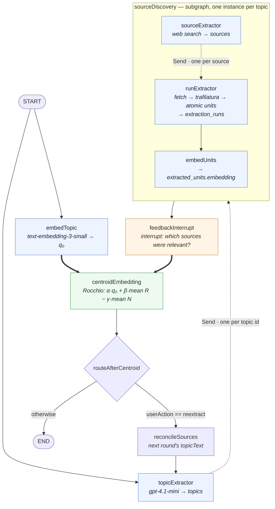
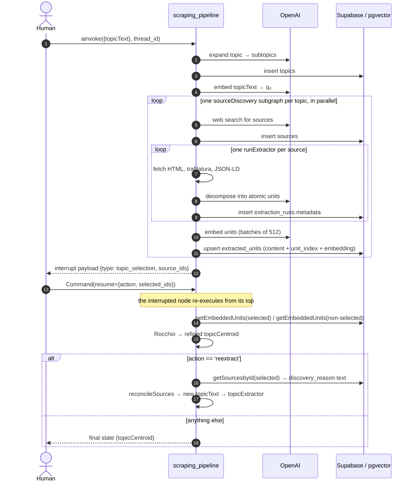
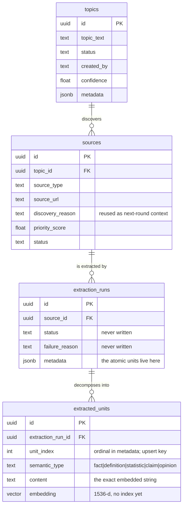

# YouTubeExtraction

> A research **knowledge-extraction pipeline** on **LangGraph + Supabase/pgvector**.
> One research topic goes in; subtopics, web sources, atomic factual units and their
> embeddings come out — with a human-in-the-loop step that refines the topic vector
> by **Rocchio relevance feedback**.

The name is historical: the repo began as a multithreaded YouTube scraper (still
here, see [Legacy](#legacy-the-youtube-scraper)), but the active project is the
LangGraph pipeline under `src/app/`.

**Status: work in progress.** The pipeline is wired end to end and its maths is
tested, but several paths are broken in ways worth knowing before you run it —
they are listed honestly in [Known issues](#known-issues), each one verified
against the code at `df3794d`, not guessed at.

---

## Contents

1. [What it does](#what-it-does)
2. [The graph](#the-graph)
3. [A round, step by step](#a-round-step-by-step)
4. [State contract](#state-contract)
5. [Data model](#data-model)
6. [Repository layout](#repository-layout)
7. [Setup](#setup)
8. [Running](#running)
9. [Testing](#testing)
10. [Known issues](#known-issues)
11. [Roadmap](#roadmap)
12. [Legacy: the YouTube scraper](#legacy-the-youtube-scraper)

---

## What it does

Given `topicText`, one pass of the pipeline:

1. **Expands** the topic into independently researchable subtopics (`gpt-4.1-mini`,
   JSON output) and writes them to `topics`.
2. **Embeds** the original topic text into `topicCentroid` (`text-embedding-3-small`,
   1536-d) — the query vector `q₀`.
3. **Discovers** 5–15 web sources *per subtopic* with a web-search-enabled chat model,
   writing `sources` rows with a `discovery_reason` and a `priority_score`.
4. **Fetches** each source (`curl_cffi` impersonating Chrome, with a SeleniumBase
   fallback), extracts readable text with `trafilatura` plus any JSON-LD, and
   **decomposes** it into *atomic units* — one self-contained fact, definition,
   statistic, claim or opinion each — stored as JSON in `extraction_runs.metadata`.
5. **Embeds** every unit and writes it to `extracted_units` with the exact string it
   was computed from (`content`) and its ordinal (`unit_index`), upserted on
   `(extraction_run_id, unit_index)` so re-embedding a run overwrites rather than
   duplicates.
6. **Pauses** at a LangGraph `interrupt()` and asks a human which sources were
   relevant.
7. **Refines** the topic vector from that judgement:
   `q′ = norm(α·q₀ + β·mean(relevant) − γ·mean(non-relevant))`, with
   `α=1.0, β=0.75, γ=0.15`.
8. Either **ends**, or loops back to re-extract with the refined context.

The thing it does *not* yet do is retrieve anything with that refined vector — see
[Known issue #8](#retrieval) and the [ROADMAP](ROADMAP.md).

---

## The graph

`langgraph.json` exposes one graph, `scraping_pipeline`
(`src.app.graph.graph:graph`). Solid arrows are edges; dashed arrows are
`Send()` fan-outs, which run one instance of the target per item.



The two **bold** edges into `centroidEmbedding` are a single
`add_edge(["embedTopic", "feedbackInterrupt"], "centroidEmbedding")` — an
**AND-join**: the node fires only when *both* predecessors have run. That is the
cause of [Known issue #1](#the-loop).

### Node → service → model → table

| Stage | Node | Service | Model / tool | Writes |
| --- | --- | --- | --- | --- |
| Topic expansion | `nodes/topicExtractor.py` | `topicExtractionService` | `gpt-4.1-mini` + `JsonOutputParser` | `topics` |
| Topic embedding | `nodes/topicEmbed.py` | *(inline `AsyncOpenAI`)* | `text-embedding-3-small` | → `topicCentroid` |
| Source discovery | `nodes/sourceExtractor.py` | `sourceDiscoveryService` | chat model + `web_search_preview` tool | `sources` |
| Content extraction | `nodes/runExtractor.py` | `extractionService` | `curl_cffi` → SeleniumBase, `trafilatura`, `gpt-4.1-mini` structured output | `extraction_runs` |
| Unit embedding | `nodes/embedUnits.py` | `embeddingService` | `text-embedding-3-small`, batches of 512 | `extracted_units` |
| Human feedback | `nodes/interruptSelections.py` | *(LangGraph `interrupt`)* | — | → `selectedSourceIds` / `nonselectedSourceIds` |
| Centroid refinement | `nodes/centroidEmbedding.py` | `TransformationService` | Rocchio over `getEmbeddedUnits` | → `topicCentroid` |
| Routing | `nodes/routeAfterCentroid.py` | — | — | `Command(goto=…)` |
| Re-seed | `nodes/reconcileSources.py` | — | — | → `topicText` |

---

## A round, step by step



---

## State contract

`src/app/graph/state.py`. The two `Annotated[..., operator.add]` channels are
**append-only reducers** — assigning `[]` to them does not clear them, it appends
nothing (see [Known issue #2](#accumulating-state)).

| Channel | Type | Written by |
| --- | --- | --- |
| `topicText` | `str` | caller, then `reconcileSources` |
| `topicCentroid` | `list[float]` (1536) | `embedTopic`, then `centroidEmbedding` |
| `topicIds` | `Annotated[list[str], operator.add]` | `topicExtractor` |
| `sourceIds` | `Annotated[list[str], operator.add]` | `embedUnits` (via the subgraph's output schema) |
| `userAction` | `str` | `interruptSelections` |
| `selectedSourceIds` / `nonselectedSourceIds` | `list[str] \| None` | `interruptSelections` |

The subgraph runs on `sourceDiscoveryState`, whose `extraction_run_ids` channel is
also `operator.add` — that is how the fanned-out `runExtractor` instances hand their
run ids to a single `embedUnits`.

---

## Data model

Four tables, `supabase/migrations/`:



Two things to know about this schema:

- **Units live in two places.** `extraction_runs.metadata` holds the units as JSON
  (the extractor's output); `extracted_units` holds one row per unit once it has been
  embedded. `unit_index` is the join between them — the unit's ordinal in the
  metadata array — and `(extraction_run_id, unit_index)` is the upsert key added by
  `20260831101500_unit_content_alignment.sql`.
- **`content` is the exact string that was embedded.** Rows written before that
  migration have `content = null` and cannot be backfilled (their ordinal is
  unrecoverable — the whole batch shares one `created_at`). Run
  `delete from extracted_units where content is null;` and re-embed.

---

## Repository layout

```
src/app/
  graph/
    graph.py                     the top-level StateGraph + fan-out
    state.py                     GlobalState / sourceDiscoveryState / TopicState
    subgraphs/sourceDiscovery.py the per-topic map-reduce subgraph
    nodes/                       one file per node (thin: resolve repo, call service)
  services/                      all I/O and model calls
    topicExtractionService.py    topic → subtopics
    sourceDiscoveryService.py    subtopic → web sources
    extractionService.py         URL → HTML → readable text → atomic units
    embeddingServices.py         units → vectors → extracted_units
    transformationService.py     Rocchio
  prompts/transformation.py      the atomic-unit decomposition prompt
src/agent/webapp.py              FastAPI app; its lifespan initialises the repo
db/
  supabaseRepository.py          every query in the project
  session.py                     module-level repo singleton (init_repo/get_repo)
supabase/migrations/             schema
tests/                           unit / node / integration
ScrapeRun.py, exec/, utils/, logs/   legacy YouTube scraper
ROADMAP.md                       what to build next, tiered
```

The layering is consistent and worth preserving: **nodes stay thin** (resolve the
repo, call a service, return a partial state update); **services own all I/O**;
**`db/supabaseRepository.py` owns all SQL**. Every service takes its repo by
constructor injection, which is what makes the tests mock-friendly.

---

## Setup

### Prerequisites

- **Python 3.13** (`pyproject.toml` requires `>=3.13`; the legacy `Makefile` still
  says 3.12)
- [**uv**](https://docs.astral.sh/uv/)
- [**Supabase CLI**](https://supabase.com/docs/guides/local-development) + Docker
- An **OpenAI API key**
- Chrome/Chromedriver only if you want the browser fetch tier or the legacy scraper

### 1. Dependencies

```bash
uv sync
```

`requirements.txt` is **legacy-scraper only** — it contains no langgraph, openai,
supabase or trafilatura. Do not install from it.

### 2. Local Supabase

```bash
supabase start          # brings up Postgres + PostgREST on 127.0.0.1:54321
supabase db reset       # applies supabase/migrations/
```

### 3. Environment

`langgraph.json` loads `.env.local`:

```bash
# .env.local
OPENAI_API_KEY=sk-...
```

The Supabase URL and service key are **hardcoded** in
`db/supabaseRepository.py:16-17` rather than read from the environment
([Known issue #9](#configuration--tooling)).

---

## Running

```bash
uv run langgraph dev
```

Then open LangGraph Studio, or use the SDK against `http://127.0.0.1:2024`.

> **The repo singleton is initialised by the FastAPI lifespan**
> (`src/agent/webapp.py` → `init_repo()`), which `langgraph.json` mounts via its
> `http.app` entry. Importing `graph` in a bare script and calling `ainvoke` will
> raise `RuntimeError: Repo not initialized — did lifespan run?` from the first node
> that touches the database. Run through the server, or call `await init_repo()`
> yourself first.

### The human-in-the-loop interrupt

The first invocation runs until `feedbackInterrupt` and returns an `__interrupt__`
payload:

```json
{"type": "topic_selection", "source_ids": ["<uuid>", "..."]}
```

Resume with a **dict** (or a JSON string that parses to one) carrying *both* keys —
anything else raises:

```python
from langgraph.types import Command

await client.runs.wait(
    thread_id, "scraping_pipeline",
    command=Command(resume={"action": "reextract", "selected_ids": ["<uuid>"]}),
)
```

- `action == "reextract"` → loop back through `reconcileSources` for another round.
- any other value → the run ends and `topicCentroid` holds the refined vector.

Note that the node containing `interrupt()` **re-executes from its first line** on
resume; keep side effects out of anything above the `interrupt()` call.

---

## Testing

```bash
uv run pytest tests/
```

If collection dies with a `pkg_resources` `ImportError`, that is seleniumbase's
pytest plugin (a legacy-scraper dependency) meeting `setuptools>=82`, which removed
`pkg_resources`. Disable the plugins:

```bash
uv run pytest tests/ -p no:seleniumbase -p no:sb_pytest -p no:html
```

### Current state of the suite

Measured at `df3794d` against a minimal environment (pytest, pytest-asyncio,
langgraph, numpy, openai, supabase): **18 passed, 10 failed**.

| Suite | State |
| --- | --- |
| `tests/unit/test_transformation_service.py` | ✅ Rocchio maths: α/β/γ terms, normalisation, zero-vector guard, list output, and `compute_query_vector`'s fetch behaviour. |
| `tests/unit/test_embed_service.py` | ✅ Each vector is stored with the text it came from; the pairing survives an out-of-order `resp.data`; `unit_index` counts across batches; a short response raises instead of misaligning. |
| `tests/unit/test_get_embedded_units.py` | ✅ The `extracted_units ⋈ extraction_runs` filter, the JSON→list embedding decode, and the vector→text round trip. |
| `tests/node/test_centroid_embedding.py` | ✅ Repo + service wiring and the refined centroid written back to state. |
| `tests/node/test_embed_units.py` | ❌ **Stale (5 failures).** Asserts the old `{"embedded_count": n}` contract; the node now returns the whole mutated state and reads `state["source_ids"]`, so the empty-input case raises `KeyError`. |
| `tests/node/test_interrupt_selections.py` | ❌ **Stale (4 failures).** Calls the now-`async` node without awaiting it, and expects the old comma-separated-string resume contract instead of `{"action", "selected_ids"}`. |
| `tests/integration/test_feedback_loop.py` | ❌ **Stale (1 failure).** Resumes with `"s1, s3"`; the node now does `json.loads` on a string resume, so it raises `JSONDecodeError`. |
| `tests/node/test_topic_embed.py` | ⚠️ Only collectible with the full dependency set: `topicEmbed` imports an unused `MODEL` from `extractionService`, which drags trafilatura/seleniumbase into the import graph. |
| `tests/integration/test_topicExtractor.py` | ❌ Passes `llm=None` to a constructor that does not accept it, asserts `result is List[str]`, and needs a live local Supabase. |
| `tests/execdata.py` | Legacy scraper smoke test; launches a real browser. |

The three stale suites are stale in an informative way: each one documents the
contract a node *used* to have. Fixing them means first deciding what the contract
*should* be — see [Known issue #3](#node-contracts).

---

## Known issues

Everything below was verified against the code at `df3794d`, several by running the
graph's topology with stubbed nodes. They are ordered by how much they cost you.

### The loop

**1. The second round of feedback is silently dropped.**
`centroidEmbedding` is an AND-join on `["embedTopic", "feedbackInterrupt"]`, but
`embedTopic` is only reachable from `START`. On the second pass the join can never be
satisfied, so after `reconcileSources → topicExtractor → … → feedbackInterrupt` the
graph collects the human's selection **and then stops** — no Rocchio, no routing, no
`END` handling. Observed trace of a two-round run:

```
embedTopic → topicExtractor(1) → sourceDiscovery ×2 → feedbackInterrupt
  ↳ resume(reextract) → centroidEmbedding → routeAfterCentroid → reconcileSources
    → topicExtractor(2) → sourceDiscovery ×4 → feedbackInterrupt
      ↳ resume(stop) → (nothing)
```

The guard `if state.get('userAction') == 'reextract': return state` at the top of
`topicEmbed` shows the intent was for that node to run every round. Either give
`embedTopic` an inbound edge from the loop, or drop it from the join and let
`centroidEmbedding` depend on `feedbackInterrupt` alone.

<a id="accumulating-state"></a>
**2. The re-extract reset is a no-op, so every round redoes the last one.**
`route_after_centroid` returns `update={"topicIds": [], ...}`, but `topicIds` is
`Annotated[list[str], operator.add]` — the reducer *appends*, so `[]` changes
nothing. Round 2 therefore fans out over round 1's topics as well as its own (4
`sourceDiscovery` runs instead of 2), re-discovering and re-extracting sources that
were already processed — real money, since every extra source is a fetch plus two
model calls. `sourceIds` accumulates the same way, so the interrupt payload grows and
lists duplicates. Clearing an `operator.add` channel needs a reducer that supports it
(e.g. a sentinel the reducer interprets as "replace"), not an empty list.

<a id="node-contracts"></a>
**3. Two nodes return the whole mutated state.**
`embedUnits` and `centroidEmbedding` mutate the state dict and `return state` instead
of returning a partial update. With reducer channels in play this is an anti-pattern
— the returned `topicIds`/`sourceIds` get *re-appended* to themselves — and it is
what makes their tests fail. `embedUnits` also reads `state["source_ids"]`, which is
only present on the subgraph's channel state, never on the fan-in it is tested with.

### Extraction

**4. The browser fetch tier is dead code — and it costs a browser launch to find out.**
`extractionService.py:2` does `from datetime import time`, which shadows the `time`
module. `_browser_fetch` then calls `time.monotonic()` →
`AttributeError: type object 'datetime.time' has no attribute 'monotonic'`, raised
*after* SeleniumBase has started Chrome and navigated. The broad `except Exception`
swallows it and logs "Browser fetch failed", so every Cloudflare-guarded source
silently yields nothing. Fix: `import time` (and drop the unused `datetime` import).

**5. `createExtractions` writes a column the schema does not have.**
It inserts `{"source_id", "topic_id", "metadata"}` into `extraction_runs`, but the
committed migrations define no `topic_id` on that table (only `sources.topic_id`).
Against a freshly migrated database this insert fails. `ROADMAP.md` §0.4 also joins
on `extraction_runs.topic_id` — so the column is wanted; it just needs a migration.

**6. A failed fetch is recorded as a successful empty run.**
When `sourceHTML` returns `None`, `build_extraction_input` still runs (trafilatura
yields `""`, the JSON-LD parser catches its `TypeError` and returns `{}`), the LLM is
asked to decompose an empty document, and an `extraction_runs` row is written with
`metadata: []`. Meanwhile `status`, `failure_reason`, `started_at`, `completed_at`
and `confidence` are never written on any run — every column that would let you tell
a failure from an empty page stays null.

**7. `sourceDiscoveryService` has an invalid model id and prompt debris.**
`ChatOpenAI(model="gpt-5.4")` is not a real model id and fails at call time. The
prompt string carries a stray `s` on its own line, and line ~35 is a no-op statement
`metadata["topic_text"]` that evaluates and discards.

### Retrieval

**8. Nothing ever queries by vector.**
`topicCentroid` is computed, refined, and never used to retrieve: `reconcileSources`
builds the next round's `topicText` by concatenating `discovery_reason` *prose*.
There is no similarity query anywhere in the repo, and `extracted_units.embedding`
has **no index**. `getEmbeddedUnits` is the only vector read and it exists solely to
compute a mean. Closing this loop is Tier 0 of the [ROADMAP](ROADMAP.md) and blocks
everything else in it.

`db/supabaseRepository.py:getSources` also filters `.eq('id', topic_id)` where it
means `.eq('topic_id', topic_id)`. It is currently unused.

### Configuration & tooling

**9. Hardcoded credentials.** `db/supabaseRepository.py:16-17` pins the local URL and
a `sb_secret_…` key. Local-dev values, but they should come from the environment.

**10. Undeclared direct dependencies.** `pyproject.toml` lists neither `openai` nor
`langchain-core`, both imported directly; they resolve transitively today.

**11. Python version drift.** `pyproject.toml` says `>=3.13`, the `Makefile` says
`python3.12`.

**12. CI runs the wrong thing.** `.github/workflows/makefile.yml` runs
`make run-scraper`, which launches real Chrome browsers to scrape YouTube inside
GitHub Actions — slow, flaky, unrelated to the pipeline, and it never runs the test
suite. The `make test` target points at `tests/test_execdata.py`, which does not
exist (the file is `tests/execdata.py`).

**13. Over-broad grants.** The initial migration grants `delete`/`truncate`/`update`
on every table to `anon` (default Supabase scaffolding). Tighten before deploying.

---

## Roadmap

[`ROADMAP.md`](ROADMAP.md) is the plan for making the vectors load-bearing, tiered so
each step makes the next measurable:

| Tier | Theme |
| --- | --- |
| **0** | Make the vectors load-bearing — normalise at write time, index the column, give `topicCentroid` a consumer (`match_units`) and a `retrieveEvidence` node. **Blocking.** |
| **1** | Past the single centroid — anchor to `q₀`, Ide dec-hi, anisotropy correction, fitted boundaries, multi-vector topics. |
| **2** | Ranking and presentation — hybrid retrieval with RRF, MMR/DPP diversification, Matryoshka cascade, near-duplicate collapse. |
| **3** | Evaluation — log every interrupt as a bandit event, hand-write nDCG/MRR/Recall@k, replay offline to fit α/β/γ, correct for logging bias. |
| **4** | Learn the geometry — low-rank metric learning, contrastive adapter, LinUCB over sources, active learning for the interrupt. |
| **5** | Study the space — singular spectrum, bottom-up vs top-down topics, hyperbolic topic trees. |

---

## Legacy: the YouTube scraper

The original project, untouched by the pipeline work and independent of it.
`exec/executor.py` keeps a pool of persistent SeleniumBase browsers across processes
so browser startup is paid once, and `utils/YouTubeScraper.py` drives them to collect
video metadata and comments for a list of queries, dumping JSON.

```bash
make install install-chrome install-chromedriver
make run-scraper

# or directly
python ScrapeRun.py run-executor \
  --queries "Red Dead Redemption" --queries "God of War 2" \
  --max-cpu-count 4 --max-cpu-usage
```

It needs a real Chrome + ChromeDriver and `SELENIUMBASE_CHROME_DRIVER` set — the
Makefile targets handle both.
