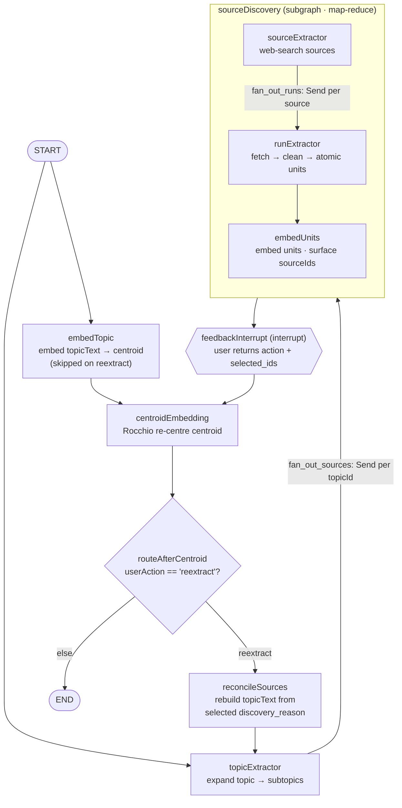

# YouTubeExtraction

> A research **knowledge-extraction pipeline** built on LangGraph + Supabase/pgvector.
> It started life as a multithreaded YouTube scraper (still in the repo), but the
> active project is now a topic → source → extraction → embedding pipeline that turns
> a single research topic into a searchable store of embedded "atomic facts."

⚠️ **Status: work in progress.** The pipeline runs end-to-end in spirit but several
nodes have known bugs (see [Known Issues / Review Findings](#known-issues--review-findings)).
Treat this README as a map of *what the code is trying to do*, with the rough edges
called out honestly.

---

## Table of Contents

1. [What this repo is](#what-this-repo-is)
2. [Architecture](#architecture)
3. [Repository layout](#repository-layout)
4. [Data model](#data-model)
5. [Setup](#setup)
6. [Running](#running)
7. [Testing](#testing)
8. [Known Issues / Review Findings](#known-issues--review-findings)
9. [Legacy: the YouTube scraper](#legacy-the-youtube-scraper)

---

## What this repo is

There are **two generations of code** living side by side:

| Generation | Purpose | Entry point | Key files |
| --- | --- | --- | --- |
| **Current — LangGraph pipeline** | Given a research topic, expand it into subtopics, discover web sources for each, fetch & clean their content, decompose it into atomic factual units, and embed those units into a pgvector store. | `langgraph.json` → graph `scraping_pipeline` | `src/app/graph/`, `src/app/services/`, `db/`, `supabase/` |
| **Legacy — YouTube scraper** | Search YouTube for a list of queries with a pool of persistent Selenium browsers and dump video metadata + comments to JSON. | `ScrapeRun.py` (Click CLI) | `ScrapeRun.py`, `exec/executor.py`, `utils/YouTubeScraper.py` |

The recent commit history (`content extraction && subgraph creation`,
`fan out extractions`, `Rocchio Relevance`) and the branch
`reimplement/extraction-langraph` all belong to the **pipeline**. The scraper is
kept around but is not part of the pipeline's data flow.

The name "YouTubeExtraction" is historical — the current pipeline is **source-agnostic**
(it fetches arbitrary web URLs), not YouTube-specific.

---

## Architecture

The pipeline is a LangGraph `StateGraph` (`src/app/graph/graph.py`) with a nested
map-reduce subgraph. Every stage is a thin **node** that delegates to a **service**,
which does the LLM/HTTP work and persists to **Supabase**.

As of `makeFeedbackLoop`, the graph is no longer a straight line. After the Rocchio
centroid is computed, `routeAfterCentroid` reads the human's `userAction` from the
interrupt and **either finalises the run (END) or loops back to the top**: on
`reextract` it routes through `reconcileSources`, which rebuilds `topicText` from the
selected sources' `discovery_reason`, and re-enters at `topicExtractor` for another pass.



### Stage-by-stage (node → service → table)

| Stage | Node | Service | Model / tool | Writes |
| --- | --- | --- | --- | --- |
| Topic expansion | `nodes/topicExtractor.py` | `services/topicExtractionService.py` | `gpt-4.1-mini` (JSON output) | `topics` |
| Topic embedding | `nodes/topicEmbed.py` | *(inline OpenAI call)* | `text-embedding-3-small` | *(returns `topicCentroid` to state)* |
| Source discovery | `nodes/sourceExtractor.py` | `services/sourceDiscoveryService.py` | `ChatOpenAI` + `web_search_preview` tool | `sources` |
| Content extraction | `nodes/runExtractor.py` | `services/extractionService.py` | curl_cffi → SeleniumBase fallback, `trafilatura`, `gpt-4.1-mini` structured output | `extraction_runs` |
| Unit embedding | `nodes/embedUnits.py` | `services/embeddingServices.py` | `text-embedding-3-small` | `extracted_units` (+ surfaces `sourceIds` to state) |
| Human feedback | `nodes/interruptSelections.py` | *(LangGraph `interrupt`)* | — (human-in-the-loop) | *(returns `userAction` + `selectedSourceIds` / `nonselectedSourceIds`)* |
| Centroid refinement | `nodes/centroidEmbedding.py` | `services/transformationService.py` | Rocchio + `getEmbeddedUnits` (pgvector) | *(updates `topicCentroid`)* |
| Loop routing | `nodes/routeAfterCentroid.py` | *(LangGraph `Command`)* | — | *(routes on `userAction`: `reextract` → `reconcileSources`, else → END; resets loop state)* |
| Source reconciliation | `nodes/reconcileSources.py` | `getSourcesbyId` (Supabase) | — | *(rebuilds `topicText` from selected `discovery_reason`s, then re-enters `topicExtractor`)* |

### Key concepts

- **Fan-out / map-reduce.** `fan_out_sources` (top graph) and `fan_out_runs`
  (subgraph) use LangGraph `Send` to run one branch per topic / per source in
  parallel. Results are reduced back through `Annotated[list, operator.add]`
  reducers on the state (e.g. `topicIds`, `extraction_run_ids`).
- **Atomic units.** `runExtractor` decomposes each source into self-contained
  statements typed as `fact | definition | statistic | claim | opinion`
  (see the prompt in `src/app/prompts/transformation.py`). This is the granularity
  that gets embedded and retrieved.
- **Tiered fetching.** `extractionService.sourceHTML()` tries a fast
  `curl_cffi` request impersonating Chrome first, and only falls back to a real
  headless SeleniumBase browser (behind a 2-slot semaphore) if the response looks
  blocked or too small.
- **Human-in-the-loop source selection.** After `sourceDiscovery` runs, the
  `feedbackInterrupt` node (`nodes/interruptSelections.py`, now `async`) calls
  LangGraph's `interrupt()` to **pause the run** and hand the discovered `sourceIds`
  back to the caller. The human resumes with a JSON payload
  `{"action": "reextract" | "<finalize>", "selected_ids": [...]}` (a JSON string is
  `json.loads`-parsed; a dict is used as-is). The node stores `action` as `userAction`
  and partitions `selected_ids` into `selectedSourceIds` / `nonselectedSourceIds`.
  Because it interrupts, the graph must be run with a **checkpointer** and resumed with a
  `Command(resume=...)` (see *Running*).
- **Re-extraction feedback loop.** After `centroidEmbedding`, `routeAfterCentroid`
  (`nodes/routeAfterCentroid.py`) branches on `userAction`. When it is `reextract` it
  returns a `Command(goto="reconcileSources", update={...})` that clears the per-pass
  loop state (`topicText`, `topicState`, `topicIds`, `selectedSourceIds`,
  `nonselectedSourceIds`); `reconcileSources` (`nodes/reconcileSources.py`) then fetches
  the selected sources' `discovery_reason` via `getSourcesbyId` and joins them into a new
  `topicText`, and the graph re-enters at `topicExtractor` for another pass. Any other
  `userAction` routes to END. `embedTopic` short-circuits (`return state`) when
  `userAction == "reextract"` so it doesn't re-embed the original topic on loop passes.
- **Rocchio relevance feedback (now wired in).** `centroidEmbedding`
  (`nodes/centroidEmbedding.py`) feeds the topic centroid and the human's
  selected / non-selected sources to `TransformationService.compute_query_vector`,
  which fetches each set's unit embeddings (`getEmbeddedUnits`) and applies the
  classic Rocchio query-refinement formula
  (`α·q0 + β·mean(relevant) − γ·mean(non-relevant)`, then L2-normalised) to
  **re-centre `topicCentroid`**. `embedTopic` and `feedbackInterrupt` are both
  upstream of this node, so it runs once the initial centroid and the feedback are
  available. As of the latest commit this replaces the earlier "dead code" status:
  `transformationService.py` is now a real `TransformationService` class (repo-backed,
  with a `@staticmethod rocchio_embedding` and a divide-by-zero guard).

---

## Repository layout

```
YouTubeExtraction/
├── langgraph.json                 # LangGraph entry: graph `scraping_pipeline` + FastAPI app
├── pyproject.toml                 # Current dependency source of truth (uv, Python ≥3.13)
├── main.py                        # Unused "Hello" stub
│
├── src/
│   ├── app/
│   │   ├── graph/
│   │   │   ├── graph.py            # Top-level StateGraph (…centroidEmbedding → routeAfterCentroid → END | reconcileSources → topicExtractor loop)
│   │   │   ├── state.py            # TypedDict states: GlobalState / TopicState / sourceDiscoveryState (+ userAction / sourceIds / selected / non-selected)
│   │   │   ├── nodes/              # Thin graph nodes (delegate to services)
│   │   │   │   ├── topicExtractor.py
│   │   │   │   ├── topicEmbed.py
│   │   │   │   ├── sourceExtractor.py
│   │   │   │   ├── runExtractor.py
│   │   │   │   ├── embedUnits.py
│   │   │   │   ├── centroidEmbedding.py   # Rocchio centroid refinement (now wired in)
│   │   │   │   ├── interruptSelections.py # human-in-the-loop source selection (interrupt → userAction + selected_ids)
│   │   │   │   ├── routeAfterCentroid.py  # Command router: reextract → loop back, else END
│   │   │   │   └── reconcileSources.py    # rebuilds topicText from selected discovery_reason for the next pass
│   │   │   └── subgraphs/
│   │   │       └── sourceDiscovery.py      # map-reduce subgraph: sourceExtractor → runExtractor → embedUnits
│   │   ├── services/               # Business logic + LLM/HTTP calls
│   │   │   ├── topicExtractionService.py
│   │   │   ├── sourceDiscoveryService.py
│   │   │   ├── extractionService.py        # fetch → clean → atomic-unit decomposition
│   │   │   ├── embeddingServices.py
│   │   │   └── transformationService.py    # TransformationService: Rocchio (wired into centroidEmbedding)
│   │   └── prompts/
│   │       └── transformation.py           # atomic-unit system prompt + message builder
│   └── agent/
│       └── webapp.py               # FastAPI app; lifespan initializes the Supabase repo
│
├── db/
│   ├── supabaseRepository.py       # All Supabase CRUD (topics/sources/extraction_runs/extracted_units)
│   └── session.py                  # Lazy singleton repo (init_repo / get_repo)
│
├── supabase/
│   ├── config.toml                 # Local Supabase stack config (ports, auth, storage…)
│   └── migrations/*.sql            # Schema: 4 tables + pgvector + FKs + grants
│
├── logs/Logging.py                 # Small logging wrapper (legacy scraper)
│
├── tests/
│   ├── node/test_embed_units.py    # Unit tests for the embedUnits node (solid)
│   ├── unit/test_embed_service.py  # Tests the *intended* embed_pending shape (see Known Issues)
│   ├── integration/test_topicExtractor.py  # Currently broken (see Known Issues)
│   └── execdata.py                 # Legacy scraper smoke test
│
└── ── Legacy scraper ──
    ├── ScrapeRun.py                # Click CLI: `run-executor`
    ├── exec/executor.py            # SeleniumThreadPoolExecutor (pool of persistent browsers)
    ├── utils/YouTubeScraper.py     # YouTube search/scroll/collect + comment scraping
    ├── Makefile                    # install / chrome / chromedriver / run-scraper / test / lint
    ├── requirements.txt            # Legacy-only deps (NOT the pipeline deps)
    └── .github/workflows/makefile.yml  # CI that runs the legacy scraper
```

---

## Data model

Defined in `supabase/migrations/20260616094321_init_changes.sql`. Postgres with the
`vector` (pgvector) extension. One-to-many all the way down:

```
topics ──1:N──► sources ──1:N──► extraction_runs ──1:N──► extracted_units
```

| Table | Key columns | Notes |
| --- | --- | --- |
| `topics` | `id`, `topic_text`, `status`, `created_by`, `confidence`, `metadata` (jsonb) | One row per (sub)topic produced by `topicExtractor`. |
| `sources` | `id`, `topic_id` (FK), `source_type`, `source_url`, `discovery_reason`, `priority_score`, `status` | Web sources discovered per topic. |
| `extraction_runs` | `id`, `source_id` (FK), `status`, `confidence`, `metadata` (jsonb) | One run per source fetch/extraction. Atomic units are currently stored **inside `metadata`** as JSON. |
| `extracted_units` | `id`, `extraction_run_id` (FK), `semantic_type`, `content`, `confidence`, `embedding vector(1536)` | Intended home for individual atomic units + their embeddings. See Known Issues — the code doesn't fully populate this yet. The Rocchio step reads embeddings back via `getEmbeddedUnits`, joining `extracted_units → extraction_runs` on `source_id`. |

> The migration grants full DML (including `delete`/`truncate`) to the `anon` role.
> That is the default Supabase scaffolding and is fine for local dev, but must be
> tightened before any non-local deployment.

---

## Setup

### Prerequisites

- **Python 3.13** (`pyproject.toml` requires `>=3.13`).
- **[uv](https://docs.astral.sh/uv/)** for dependency management.
- **[Supabase CLI](https://supabase.com/docs/guides/cli)** (a local stack is used;
  see `supabase/config.toml`).
- An **OpenAI API key** (topic expansion, source discovery, extraction, and embeddings
  all call OpenAI).

### 1. Install dependencies

```bash
uv sync
```

> Note: `pyproject.toml` is the current source of truth. `requirements.txt` only
> covers the legacy scraper and will **not** install the pipeline's dependencies.
> Also see Known Issues — a few imported packages (`openai`, `langchain-openai`,
> `langchain-core`) are not yet declared in `pyproject.toml`.

### 2. Start the local Supabase stack

```bash
supabase start          # boots Postgres, Studio, API on the ports in config.toml
supabase db reset       # applies migrations/ (creates the 4 tables + pgvector)
```

The API defaults to `http://127.0.0.1:54321`, Studio to `http://127.0.0.1:54323`.

### 3. Environment variables

`langgraph.json` loads `.env.local`. At minimum you'll want:

```bash
# .env.local
OPENAI_API_KEY=sk-...
```

> Supabase connection details are currently **hardcoded** in
> `db/supabaseRepository.py` (local URL + a local `sb_secret_...` key). See Known
> Issues — these should be moved to env vars before connecting to any real project.

---

## Running

### The pipeline (LangGraph dev server)

```bash
uv run langgraph dev
```

This serves the `scraping_pipeline` graph (from `langgraph.json`) and the FastAPI app
in `src/agent/webapp.py`, which initializes the Supabase repo on startup. Open the
LangGraph Studio URL it prints, then invoke the graph with an input containing a
`topicText`, e.g.:

```json
{ "topicText": "quantum error correction" }
```

The run will expand the topic into subtopics, discover sources, extract and decompose
their content, and embed the resulting units — writing to the `topics`, `sources`,
`extraction_runs`, and `extracted_units` tables as it goes.

#### Human-in-the-loop: the source-selection interrupt

Since the Rocchio commit, the graph **pauses** after source discovery: the
`feedbackInterrupt` node calls LangGraph's `interrupt()` and returns the discovered
`sourceIds` to you. You then resume with an `action` plus the ids you consider
*relevant*; the `centroidEmbedding` node uses that feedback to re-centre the topic
centroid, and (as of `makeFeedbackLoop`) `action == "reextract"` loops the whole
pipeline back for another pass instead of ending.

Because the graph interrupts, it must run with a **checkpointer** and a thread id. In
LangGraph Studio, the run will surface the `{"type": "topic_selection", "source_ids": [...]}`
payload and let you resume. Programmatically it looks like:

```python
import json
from langgraph.types import Command

config = {"configurable": {"thread_id": "my-run"}}

# 1) First invocation pauses at the interrupt.
result = await graph.ainvoke({"topicText": "quantum error correction"}, config)
payload = result["__interrupt__"][0].value          # {"type": "topic_selection", "source_ids": [...]}

# 2) Resume with an action + the relevant source ids (JSON string or dict).
#    action == "reextract" loops back through reconcileSources → topicExtractor;
#    any other action finalises the run at END.
final = await graph.ainvoke(
    Command(resume=json.dumps({"action": "finalize", "selected_ids": ["src-id-1", "src-id-3"]})),
    config,
)
# final["topicCentroid"] is now the Rocchio-refined centroid.
```

> Note: `graph.compile()` in `graph.py` does **not** attach a checkpointer, so the
> interrupt only survives when the graph is served by a runtime that supplies one
> (the LangGraph dev server / API does). A bare `graph.ainvoke(...)` with no
> checkpointer cannot pause and resume.

### The legacy scraper

See [Legacy: the YouTube scraper](#legacy-the-youtube-scraper).

---

## Testing

Tests use `pytest` (config in `pyproject.toml`, `asyncio_mode = "auto"`,
`pythonpath = ["."]`).

```bash
# The seleniumbase pytest plugin (a legacy-scraper dep) crashes on collection
# with setuptools ≥82 because pkg_resources was removed. Disable it + pytest-html
# to run the pipeline suite:
uv run pytest -p no:seleniumbase -p no:sb_pytest -p no:html tests/ -v
```

### Existing suites

| Suite | State |
| --- | --- |
| `tests/node/test_embed_units.py` | **⚠️ Broken by the Rocchio commit.** The node now returns the whole mutated `state` (not `{"embedded_count": ...}`) and reads `state["source_ids"]`, so every assertion here fails and the empty-input case raises `KeyError`. These tests still describe the *old* contract and need rewriting (or the node needs revisiting — see Known Issues). |
| `tests/unit/test_embed_service.py` | **Aspirational.** Asserts an id-keyed `{"id", "embedding"}` update shape that the current `embeddingService`/repo don't produce — documents the intended fix rather than current behavior. |
| `tests/integration/test_topicExtractor.py` | **Broken.** Passes `llm=None` to a constructor that doesn't accept it and asserts `result is List[str]`. Also hits a live local Supabase. |
| `tests/execdata.py` | Legacy scraper smoke test; launches a real browser. |

### Tests added for the Rocchio / feedback work

These cover the code the latest commit introduced (all mock-only — no live
Supabase or OpenAI — and all pass under the command above):

| Suite | Covers |
| --- | --- |
| `tests/unit/test_transformation_service.py` | `rocchio_embedding` math (α/β/γ terms, normalisation, zero-vector guard, list output) and `compute_query_vector` (fetches both selections, skips the repo on empty id lists). |
| `tests/unit/test_get_embedded_units.py` | `SupabaseRepository.getEmbeddedUnits` — the `extracted_units ⋈ extraction_runs` filter and JSON→list embedding decode, against a fake client chain. |
| `tests/node/test_topic_embed.py` | `topicEmbed` now uses `text-embedding-3-small` and returns `topicCentroid` (the two bugs the commit fixed). |
| `tests/node/test_interrupt_selections.py` | `interruptSelections` — string vs list resume input, selected/non-selected partition, and the interrupt payload shape. |
| `tests/node/test_centroid_embedding.py` | `centroidEmbedding` wires the repo + `TransformationService` and writes the refined centroid back to state. |
| `tests/integration/test_feedback_loop.py` | Drives `feedbackInterrupt → centroidEmbedding` in a real `StateGraph` with a `MemorySaver` checkpointer: invoke → pause at interrupt → `Command(resume=...)` → recomputed centroid. |
| `tests/conftest.py` | Sets a dummy `OPENAI_API_KEY` so modules that build an `AsyncOpenAI()` at import time (e.g. `topicEmbed`) can be collected. |

### Still needed

- **Rewrite `tests/node/test_embed_units.py`** to the node's current contract once
  its return shape is settled (see Known Issue #13).
- **A live integration test for `getEmbeddedUnits`** against a seeded local Supabase
  (the join on `extraction_runs.source_id` and the JSON-string `embedding` column are
  only exercised with a fake client today).
- **A full-graph resume test** (`graph.py`) once the upstream nodes it depends on
  (`sourceDiscoveryService` model id, `embedUnits` return shape) are fixed — currently
  a real end-to-end run can't reach the interrupt.
- **`embed_pending` tests against real repo/OpenAI shapes** (the aspirational
  `test_embed_service.py` should become executable once the metadata→`extracted_units`
  migration lands).

> The `Makefile` `test` target points at `tests/test_execdata.py`, which does not
> exist (the file is `tests/execdata.py`).

---

## Known Issues / Review Findings

These were found while parsing the code and are documented here so they're visible.
The **Rocchio commit** (`feat: implement Rocchio relevance feedback for topic
embeddings`) fixed several of the items below (marked ✅) and introduced one new
regression (#13). The **`makeFeedbackLoop` commit** then added the re-extraction loop,
which has its own open logical issues (#15–#19). The remaining items are still open.

### Correctness bugs (pipeline)

1. ✅ **Fixed — `nodes/topicEmbed.py` wrong model + dropped result.**
   Previously it called `client.embeddings.create(model=MODEL, ...)` with the **chat**
   model `MODEL` (`"gpt-4.1-mini"`) and returned `{"topicEmbedding": ...}`, a key
   `GlobalState` doesn't define. The Rocchio commit hard-codes
   `model='text-embedding-3-small'` and returns `{"topicCentroid": ...}`. (The now-unused
   `from ...extractionService import MODEL` import is still present but harmless.)

2. **`services/sourceDiscoveryService.py` — invalid model + prompt typos.**
   `ChatOpenAI(model="gpt-5.4")` is not a real model id and will fail at call time.
   The prompt string has a **stray `s`** on its own line, and there is a no-op
   statement `metadata["topic_text"]` (line ~35) that does nothing.

3. **Embeddings are orphaned from their text.**
   `runExtractor`/`extractionService` store atomic units **inside**
   `extraction_runs.metadata` (JSON). `embeddingService.embed_pending` then reads
   that JSON, embeds each unit's `text`, and calls `updateUnitEmbeddings` — which
   **inserts** brand-new `extracted_units` rows containing only
   `{extraction_run_id, embedding}`. The unit `content` is never written, and the
   embeddings aren't linked back to the specific unit they came from. The repo's own
   TODO at `db/supabaseRepository.py:129` acknowledges this ("Need to alter and
   migrate data in metadata to create a new column called text"). Consequently
   `tests/unit/test_embed_service.py` — which expects `{"id", "embedding"}` keyed by
   unit id — does not match the current code.

4. **`db/supabaseRepository.py` — `getSources` filters the wrong column.**
   It does `.eq('id', topic_id)` where it should be `.eq('topic_id', topic_id)`.
   (This method is currently unused, but the query is wrong.)

5. ✅ **Fixed — `centroidEmbedding.py` / `interruptSelections.py` were stubs.**
   `centroidEmbedding.py` used to be the bare token `import ` (a `SyntaxError`) and
   `interruptSelections.py` was empty. The Rocchio commit implements both: the former
   calls `TransformationService.compute_query_vector`, the latter is the human-in-the-loop
   `interrupt()` node. Both are now wired into `graph.py`.

6. ✅ **Fixed — `transformationService.py` `rocchio_embedding` signature + wiring.**
   It's now a proper `@staticmethod` on the renamed `TransformationService` class (with
   a divide-by-zero guard and `.tolist()` output), and it *is* wired into the graph via
   `centroidEmbedding`. Note the **class was renamed** `transformationService` →
   `TransformationService`; any external importer using the old name must update.

### Regression introduced by the Rocchio commit

13. **`nodes/embedUnits.py` — changed contract breaks its tests + can `KeyError`.**
    To surface source ids for the new interrupt, `embedUnits` now does
    `state['sourceIds'] = [X['id'] for X in state['source_ids']]` and `return state`
    (the whole mutated dict) instead of the previous `return {"embedded_count": total}`.
    Two problems:
    - It reads `state["source_ids"]`, which isn't set on the fan-in path — the node's
      own tests call it with only `extraction_run_ids`, so it raises `KeyError:
      'source_ids'`. **All of `tests/node/test_embed_units.py` now fails.**
    - Returning the full mutated `state` (rather than a partial update) is a LangGraph
      anti-pattern and also drops the `embedded_count` the old tests asserted.
    Decide the intended contract (likely: return a partial `{"sourceIds": [...]}` and
    read source ids from wherever they're actually populated), then rewrite the node's
    tests to match.

### Re-extraction feedback loop (`makeFeedbackLoop`)

These are logical issues in the loop the latest commit added
(`centroidEmbedding → routeAfterCentroid → reconcileSources → topicExtractor`):

15. **The loop-state reset is a no-op for reducer channels.** `routeAfterCentroid`
    returns `Command(update={"topicIds": [], ...})`, but `topicIds` and `sourceIds` are
    `Annotated[List, operator.add]`, so the update computes `old + [] = old` and never
    clears. On each `reextract` pass the previous topic/source ids persist and new ones
    are appended, so `fan_out_sources` re-fans over stale topics and the id lists grow
    unbounded. (`topicText`, `topicState`, and the selection lists are plain channels, so
    those do reset.)
16. **The human's selection is discarded on re-extraction.** `routeAfterCentroid` sets
    `selectedSourceIds=None` *before* routing to `reconcileSources`, whose
    `state.get("selectedSourceIds") or state["sourceIds"]` then always falls through to
    the full (accumulated) `sourceIds`. The relevance feedback the loop exists to act on
    never reaches `reconcileSources`.
17. **`topicEmbed`'s `reextract` guard is unreachable via the loop.** The node guards
    `if state.get('userAction') == 'reextract': return state`, implying it re-runs each
    pass, but the graph only wires `START → embedTopic`; the loop re-enters at
    `topicExtractor`. So the guard is effectively dead code and the
    `["embedTopic", "feedbackInterrupt"] → centroidEmbedding` join is fragile on pass ≥2.
18. **No loop-termination guard.** Nothing bounds the number of `reextract` iterations;
    a caller repeatedly choosing `reextract` loops indefinitely while ids and DB writes
    accumulate.
19. **Whole-`state` returns re-apply reducers.** `centroidEmbedding` and the `topicEmbed`
    guard `return state` (like `embedUnits`, see #13); channels with `operator.add`
    (`topicIds`, `sourceIds`, `extraction_run_ids`) then re-add their own contents, and
    the loop compounds the duplication every pass. `getSourcesbyId` also raises
    `ValueError` on an empty result, so a legitimately empty selection crashes
    `reconcileSources`. Debug `print()` calls remain in `routeAfterCentroid` and
    `interruptSelections`.

### Configuration & tooling

7. **Missing declared dependencies.** `pyproject.toml` imports `openai`,
   `langchain-openai`, and `langchain-core` at runtime but doesn't list them as
   direct dependencies. They may resolve transitively today, but that's fragile.

8. **Python version drift.** `pyproject.toml` requires `>=3.13`; the `Makefile` uses
   `python3.12`; the old README claimed 3.12. Pick one.

9. **`requirements.txt` is legacy-only.** It has no `langgraph`, `openai`,
   `langchain`, `supabase`, `trafilatura`, or `curl-cffi` — installing from it will
   not give you a working pipeline. Use `uv sync`.

10. **CI runs the wrong thing.** `.github/workflows/makefile.yml` runs
    `make run-scraper`, which launches real Chrome browsers to scrape YouTube inside
    GitHub Actions — slow, flaky, and unrelated to the pipeline. The `make test`
    target references a non-existent `tests/test_execdata.py`.

14. **`pytest` collection crashes out of the box.** `seleniumbase` (a legacy-scraper
    dep) ships a pytest plugin whose `pytest_configure` reads pytest-html's `htmlpath`
    option, and pytest-html imports `pkg_resources` — which `setuptools>=82` (pinned via
    `setuptools>=82.0.1`) removed. So a plain `uv run pytest tests/` dies during plugin
    load. Work around it with `-p no:seleniumbase -p no:sb_pytest -p no:html`, or drop
    seleniumbase from the pipeline's test environment.

### Security / operational

11. **Hardcoded Supabase credentials.** `db/supabaseRepository.py:16-17` hardcodes the
    local URL and `sb_secret_...` key. Even though these are local-dev values, they
    should be read from the environment so the code works against a real project and
    no key is committed.

12. **Over-broad DB grants.** The migration grants `delete`/`truncate`/`update` to the
    `anon` role on every table (default Supabase scaffolding). Fine locally; tighten
    before deploying.

---

## Legacy: the YouTube scraper

The original project — a multithreaded Selenium scraper for YouTube search results.
It is independent of the pipeline above.

**How it works:** `ScrapeRun.py` exposes a Click CLI whose `run-executor` command
builds a `SeleniumThreadPoolExecutor` (`exec/executor.py`). The executor keeps a pool
of **persistent** SeleniumBase browsers (one per worker) and feeds them a queue of
search queries. Each worker runs `YouTubeScraper.scrape` (`utils/YouTubeScraper.py`),
which opens the YouTube results page, scrolls to load more videos, collects each
video's title/link/channel/views and a datetime derived from the relative timestamp,
then visits each video to scrape comments. Results are written to
`./{query}_scrape.json`.

**Run it:**

```bash
# Requires Chrome + ChromeDriver (see the Makefile targets)
make install
make install-chrome install-chromedriver
make run-scraper

# or directly:
python ScrapeRun.py run-executor \
    --queries "Python programming tutorials" \
    --queries "Machine learning basics" \
    --max-cpu-count 4
```

**Caveats:** scraping YouTube may violate its Terms of Service; the executor's own
docstrings flag some awkward API design (`class_ref` / `max_cpu_usage` are more
convoluted than they need to be); and `YouTubeScraper.search()` is an empty method
(search is done via the results URL, not the search box).

---

*This README documents the repository as it stands, including its rough edges. If you
fix an item under [Known Issues](#known-issues--review-findings), please update that
section too.*
