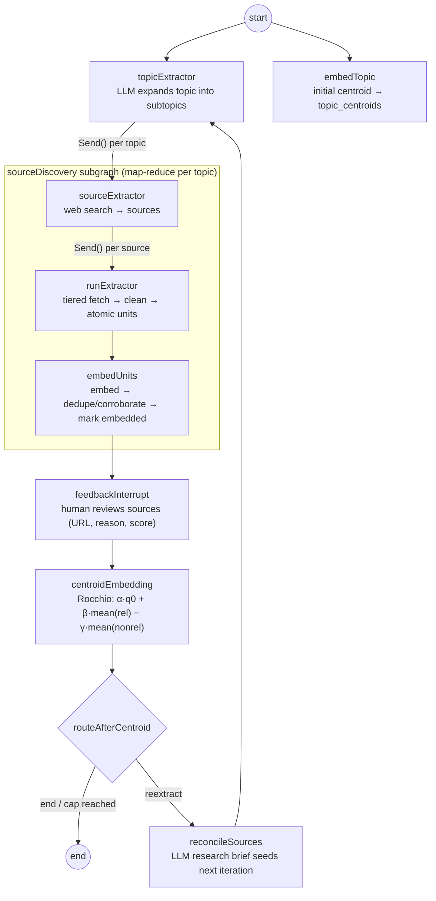

# A human-steered research engine

[](https://github.com/Stanfordrods1999/YouTubeExtraction/actions/workflows/ci.yml)

Give it a research topic. It expands the topic into subtopics, searches the
web for sources, fetches and decomposes them into **atomic facts with
provenance**, and embeds everything into pgvector. Then it **pauses and asks
you** which sources actually matter — and folds your judgment back into
retrieval using [Rocchio relevance feedback](https://en.wikipedia.org/wiki/Rocchio_algorithm)
(1971's best idea, wired into an LLM pipeline). The result is a persistent,
queryable, citable knowledge base that gets sharper every time you correct it
— not a one-shot report.

Unlike a chat "deep research" run, the corpus survives: query it, cite it,
re-extract against the gaps, and **measure** whether your feedback helped
(`evals/` computes P@k / MRR / nDCG before vs. after).

> The repository name is historical — the project began as a YouTube scraper
> (now in [`legacy/`](legacy/)). See [docs/HISTORY.md](docs/HISTORY.md) for
> the engineering history, including the bugs found and fixed along the way.

---

## Architecture

A LangGraph `StateGraph` with a nested map-reduce subgraph, a human-in-the-loop
interrupt, and a bounded feedback loop. Every node is thin and delegates to a
service; all persistence goes through one Supabase repository.



Key mechanics:

- **Fan-out / map-reduce.** One `Send()` per topic, then one per source;
  results reduce back through reducer-annotated state channels.
- **Atomic units.** Each source is decomposed into self-contained statements
  typed `fact | definition | statistic | claim | opinion`, with pronouns
  resolved and qualifiers kept — the granularity that gets embedded, deduped,
  retrieved, and cited.
- **Tiered fetching.** Fast `curl_cffi` (Chrome impersonation) first; a real
  headless browser (semaphore-capped) only when the response looks blocked.
  The winning tier is recorded on the run; total failures record a `failed`
  run instead of burning an LLM call.
- **Human-in-the-loop.** The graph pauses with a reviewable payload (URLs,
  discovery reasons, priority scores). Your selection partitions sources into
  relevant / non-relevant — the input Rocchio needs.
- **The re-extract loop.** On `"reextract"`, an LLM writes a research brief
  from the evidence your selected sources actually yielded ("what's
  established, what gaps remain") and the pipeline runs again on it — bounded
  by `MAX_ITERATIONS`. Accumulating channels reset via an `add_or_reset`
  reducer, so each iteration fans out over only its own topics (pinned by
  `tests/integration/test_reextract_loop.py`).
- **Corroboration, not copies.** Near-duplicate facts across sources
  (cosine ≥ 0.95 within a topic) collapse into one canonical unit with a
  `corroboration_count` — "stated by N independent sources" is a retrievable
  signal.

## Quickstart

Prerequisites: [uv](https://docs.astral.sh/uv/), the
[Supabase CLI](https://supabase.com/docs/guides/cli), Python 3.13, an OpenAI
API key.

```bash
uv sync
supabase start && supabase db reset      # local Postgres + pgvector + schema

echo 'OPENAI_API_KEY=sk-...' > .env.local   # everything else has working local defaults
uv run langgraph dev                     # serves the graph + the FastAPI app
```

Open the LangGraph Studio URL it prints and invoke `scraping_pipeline` with:

```json
{ "topicText": "quantum error correction" }
```

The run pauses after discovery. Resume with your source selection:

```python
from langgraph.types import Command

config = {"configurable": {"thread_id": "my-run"}}

result = await graph.ainvoke({"topicText": "quantum error correction"}, config)
payload = result["__interrupt__"][0].value
# {"type": "source_selection", "source_ids": [...],
#  "sources": [{"id", "source_url", "discovery_reason", "priority_score", ...}]}

final = await graph.ainvoke(
    Command(resume={"action": "end", "selected_ids": ["<id-1>", "<id-3>"]}),
    config,
)
# {"action": "reextract", ...} instead runs another discovery iteration
# seeded by a research brief from your selected sources' evidence.
```

(The interrupt requires a checkpointer; the dev server provides one.)

## Querying the knowledge base

Similarity search runs inside Postgres — a `match_units` RPC over an HNSW
index — so vectors never ship to Python for scoring. Every hit carries its
sentence, semantic type, similarity, corroboration count, and source citation.

```bash
# Top-k atomic facts nearest the question
curl -s localhost:2024/query -X POST -H 'content-type: application/json' \
  -d '{"question": "How do surface codes correct errors?", "k": 5}'

# Same retrieval + a synthesized answer with [n] citation markers
curl -s localhost:2024/answer -X POST -H 'content-type: application/json' \
  -d '{"question": "How do surface codes correct errors?"}'

# Browse what a run built
curl -s localhost:2024/topics
curl -s localhost:2024/topics/<topic_id>/sources
```

Pass `"thread_id": "my-run"` to blend that run's **Rocchio-refined centroid**
into the query vector — retrieval then leans toward what you marked relevant.
Both centroids (initial and refined, per iteration) are persisted in
`topic_centroids`.

## Does the feedback actually help? (evals)

`evals/` measures the loop instead of assuming it works: for each golden-set
topic it compares retrieval using the raw question, the question blended with
the **initial** centroid, and the question blended with the **refined**
centroid — on P@k, MRR, and nDCG@k. Relevance labels are source-level, the
same granularity the interrupt collects, so no per-unit labeling.

```bash
uv run python -m evals.run_eval --golden evals/golden.json --k 10
```

Workflow and golden-set format: [`evals/README.md`](evals/README.md). Rocchio
weights (α/β/γ) are env vars, so a parameter sweep is a shell loop. Paste
result tables here once generated from real runs.

## Data model

```
topics ──1:N──► sources ──1:N──► extraction_runs ──1:N──► extracted_units
                                                             ▲ pgvector + HNSW
topic_centroids (per thread: initial + refined per iteration)
```

| Table | Highlights |
| --- | --- |
| `topics` | One row per LLM-expanded subtopic (`topic_text`, `status`, `confidence`). |
| `sources` | Discovered per topic; unique on `(topic_id, source_url)` (discovery upserts — retries can't duplicate); `status` walks `discovered → extracted/failed → embedded`. |
| `extraction_runs` | One per fetch: `status`, `failure_reason`, `extraction_strategy` (curl vs browser), timestamps, and `metadata = {units, usage}` (token spend per run). |
| `extracted_units` | The product: `content`, `semantic_type`, `confidence`, `corroboration_count`, `embedding vector(1536)`. |
| `topic_centroids` | Initial + Rocchio-refined centroid per graph thread and iteration. |

Postgres functions: `match_units` (HNSW cosine top-k with citation joins),
`dedupe_units` (near-duplicate collapse + corroboration counting).

## Configuration

Everything lives in `src/app/config.py` (pydantic-settings), overridable via
env vars / `.env.local` — see [`.env.example`](.env.example):

| Variable | Default | Purpose |
| --- | --- | --- |
| `OPENAI_API_KEY` | — | Required; all LLM + embedding calls. |
| `SUPABASE_URL` / `SUPABASE_SECRET_KEY` | CLI local-dev values | Point at a hosted project to deploy. |
| `CHAT_MODEL` / `DISCOVERY_MODEL` / `EMBED_MODEL` | `gpt-4.1-mini` / `gpt-5.4` / `text-embedding-3-small` | Model routing per role. |
| `ROCCHIO_ALPHA` / `BETA` / `GAMMA` | 1.0 / 0.75 / 0.15 | Feedback weights. |
| `MAX_ITERATIONS` | 3 | Re-extract loop cap per thread. |

## Testing

```bash
uv run pytest tests/ -q      # 73 tests, all mock-based — no live services
uv run ruff check .
```

Highlights: the two-iteration loop test (interrupt → reextract → second
interrupt → finish, proving channel resets and the loop's join semantics), a
strict-zip guard against misattributing embeddings to the wrong sentences,
idempotent re-embedding, the fetch-failure short-circuit, Rocchio math, and
the pure eval metrics. CI runs lint + tests on every push.

## Repository layout

```
├── langgraph.json            # graph `scraping_pipeline` + FastAPI app entry
├── src/app/
│   ├── config.py             # pydantic-settings (models, Rocchio, loop cap)
│   ├── graph/                # StateGraph, nodes, subgraph, state + reducers
│   ├── services/             # LLM/HTTP/business logic per stage
│   └── prompts/              # atomic-unit decomposition prompt
├── src/agent/webapp.py       # /query /answer /topics API
├── db/                       # Supabase repository + lazy session
├── supabase/migrations/      # schema, match_units, dedupe_units, HNSW
├── evals/                    # Rocchio measurement harness
├── tests/                    # node / unit / integration suites
└── legacy/                   # the original YouTube scraper (self-contained)
```
