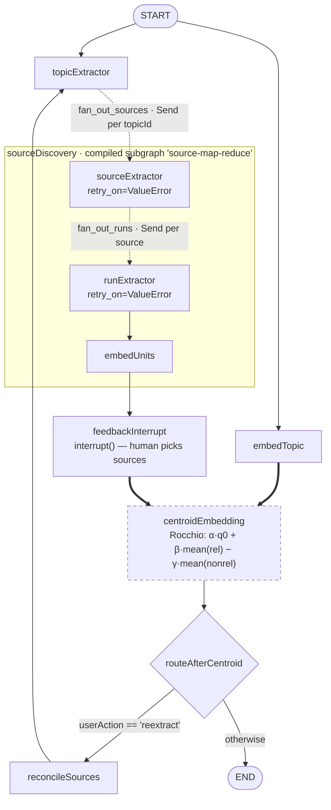
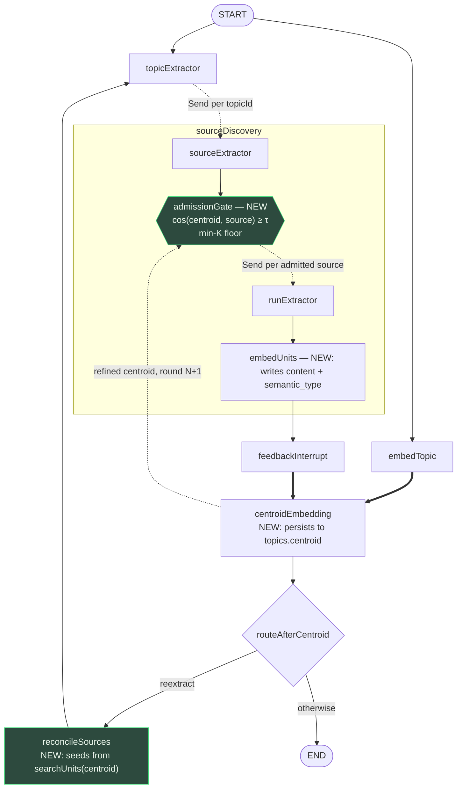

# Create `Graph.md` — as-built topology plus the unbuilt work

## Context

The README mixes what the pipeline *intends* to do with what it *currently* does, which makes
it hard to tell at a glance which parts of the graph are real. The goal here is a single
reference doc at the repo root that separates the two: an accurate picture of the graph as
committed at `7609df7`, followed by an explicit target picture showing the source-admission
gate and the retrieval path that don't exist yet — so the remaining work is legible without
re-reading every node.

Scope is documentation only. No code changes.

## File to create

`/home/user/YouTubeExtraction/Graph.md`

---

## Section 1 — Runtime requirements

Short prose block, three facts:

- `graph.py:37` compiles with `builder.compile(name="scrapingPipeline")` — **no checkpointer**.
- `interruptSelections` calls `interrupt()`, which requires one. So the graph only pauses and
  resumes under a runtime that supplies a checkpointer (`langgraph dev` / the LangGraph API).
  A bare `graph.ainvoke()` cannot complete a round.
- Every run needs a `thread_id` in `config.configurable`.

## Section 2 — As-built topology

Annotations to include below the diagram:

- The double arrows into `centroidEmbedding` are a **join** — `add_edge(["embedTopic",
  "feedbackInterrupt"], "centroidEmbedding")` at `graph.py:35` waits for both branches.
- `routeAfterCentroid` has no outgoing `add_edge`; routing comes from its
  `Command[Literal["reconcileSources", "__end__"]]` return annotation.
- `centroidEmbedding` is drawn dashed because its output is **terminal** — see Section 5.

## Section 3 — Node reference table

Columns: Node · Callable · Service · Model/tool · Reads from state · Writes to state · DB table.
Rows for all seven top-level nodes plus the three subgraph nodes. Values taken directly from the
files (e.g. `topicExtractor` → `topicExtractionService` → `gpt-4.1-mini` → reads `topicText` →
writes `topicIds` → `topics`).

## Section 4 — State channels

Table with a **Reducer** column, since that's the part that bites:

| Channel | Type | Reducer | Notes |
| --- | --- | --- | --- |
| `topicIds` | `List[str]` | `operator.add` | Accumulates; reset needs an overwrite sentinel |
| `sourceIds` | `List[str]` | `operator.add` | Same — **not** in the `routeAfterCentroid` reset dict |
| `extraction_run_ids` | `list[str]` | `operator.add` | Subgraph channel |
| `topicCentroid`, `topicText`, `userAction`, `selectedSourceIds`, `nonselectedSourceIds`, `topicState` | — | last-write-wins | |

Plus a note that `sourceDiscoveryState.source_ids` holds **full row dicts**, not ids —
`fan_out_runs` reads `sid['id']` and `sid['source_url']` — despite the name.

## Section 5 — What the graph does not yet do

The section that answers "what do I work on." Each item states the current behavior and the
target, with file references.

1. **The refined centroid is terminal.** `centroidEmbedding` writes `topicCentroid` back to
   state and nothing downstream reads it. No cosine comparison exists anywhere in `src/`.
2. **No source-admission gate.** The planned behavior — admit a source only if
   `cos(refined_centroid, source) ≥ τ` — is unimplemented. This is the change that makes the
   centroid load-bearing.
3. **No retrieval path.** `extracted_units.embedding` has no ANN index and no query. There is
   no `match_units` RPC and no repo method that searches by vector.
4. **Unit text is never stored.** `embeddingServices.py:31-35` inserts `{extraction_run_id,
   embedding}` only; `content` and `semantic_type` stay null, so a vector cannot be mapped
   back to its fact.
5. **`sourceIds` is not reset between rounds.** `routeAfterCentroid.py:15-21` resets five
   channels; `sourceIds` is not among them. Round 2's interrupt shows round 1's sources plus
   round 2's, which corrupts the selected/non-selected split feeding Rocchio.
6. **Two nodes return the whole mutated state.** `embedUnits.py:12` and
   `centroidEmbedding.py:11` both `return state`. On channels with `operator.add` this
   re-emits the existing list and doubles it.
7. **The centroid is not persisted.** It lives only in graph state and dies with the thread.
8. **No termination floor.** The `reconcileSources → topicExtractor` loop exits only when the
   human stops saying `reextract`.
9. **`sourceDiscoveryService.py:9`** — `ChatOpenAI(model="gpt-5.4")`; verify the id resolves.

## Section 6 — Target topology

The dashed feedback edge from `centroidEmbedding` to `admissionGate` is the loop closure — it
is the single edge that does not exist today.

## Section 7 — Open calibration questions

Three lines, stated as open rather than settled:

- `τ` is currently assumed at 0.9. Cosine between `text-embedding-3-small` embeddings of
  related-but-distinct texts typically sits well below that; derive it from a histogram of
  real candidate scores before hardcoding.
- Whether Rocchio refinement improves ranking is unmeasured. Precision@10 / nDCG@10 on a small
  hand-labeled set, raw centroid vs refined, is the check.
- Whether comparing a blended topic/unit centroid against `discovery_reason` text is a fair
  comparison at all — three different text distributions.

---

## Verification

1. `Graph.md` renders on GitHub — both mermaid blocks parse (quoted node labels throughout;
   `{{...}}` hexagon for the gate).
2. Every file:line reference in the doc resolves against `7609df7`.
3. Cross-check the node table against `graph.py:22-36` and `sourceDiscovery.py:17-25` — node
   count and edge list match exactly.
4. Nothing in Section 2 describes behavior that isn't committed; nothing in Section 6 is
   described as existing.