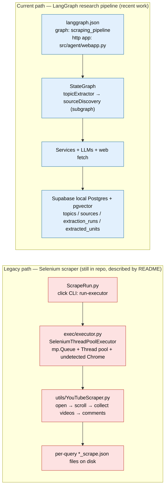
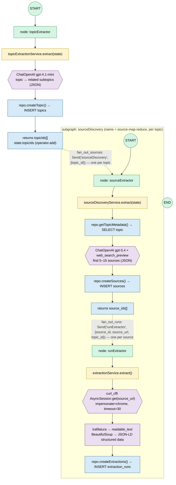
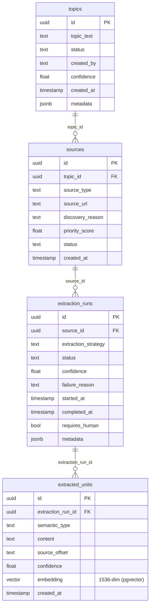

# YouTubeExtraction — Architecture (state as of now)

This document captures **what the codebase is doing today**. The repo is mid-migration
from the original Selenium YouTube scraper to a **LangGraph-based research/extraction
pipeline**. Both code paths currently coexist.

> TL;DR
> - **Legacy path** (`ScrapeRun.py` → `executor.py` → `YouTubeScraper.py`): multithreaded
>   Selenium scraper that dumps YouTube results to JSON files. Still present; the README
>   describes this one.
> - **Current path** (`src/app/graph/...` + `db/` + `supabase/`): a LangGraph pipeline that
>   expands a topic → discovers web sources → extracts page content, persisting everything
>   to a local Supabase (Postgres + pgvector). This is where the recent commits live
>   (`content extraction && subgraph creation`, `fixing html retrieval && fan out extractions`).

---

## 1. System overview — two paths

---

## 2. Current LangGraph pipeline (the detailed view)

Entry: `langgraph.json` registers the compiled graph `src.app.graph.graph:graph`
(`scrapingPipeline`) and a FastAPI HTTP app (`webapp.py`) whose lifespan calls
`init_repo()` to create the singleton `SupabaseRepository`.

The pipeline is **two levels of map-reduce fan-out** using LangGraph `Send`:

- **Level 1:** one `sourceDiscovery` subgraph run **per extracted topic**.
- **Level 2:** inside each subgraph, one `runExtractor` run **per discovered source**.

### Layer map (node → service → external/DB)

| Graph node | Service | LLM / network | DB writes (SupabaseRepository) |
|---|---|---|---|
| `topicExtractor` | `topicExtractionService` | `gpt-4.1-mini` (subtopic expansion) | `createTopic()` → `topics` |
| `sourceExtractor` | `sourceDiscoveryService` | `gpt-5.4` + `web_search_preview` | `getTopicMetadata()` read; `createSources()` → `sources` |
| `runExtractor` | `extractionService` | `curl_cffi` HTTP GET → `trafilatura` + `BeautifulSoup` | `createExtractions()` → `extraction_runs` |

All DB access funnels through the `SupabaseRepository` singleton, obtained via
`db/session.py` (`init_repo()` / `get_repo()`), pointed at a **local** Supabase
(`http://127.0.0.1:54321`).

---

## 3. Data model (Supabase / Postgres)

Defined in `supabase/migrations/20260616094321_init_changes.sql`.

---

## 4. Status / known gaps (as of now)

These are observations from the current code, useful context for the next steps:

- **`extracted_units` is defined but never written.** The pipeline stops at
  `extraction_runs` (raw `metadata`). The semantic-unit + embedding stage
  (the `vector(1536)` column) is not implemented yet.
- **`runExtractor` returns nothing** — it writes `extraction_runs` but does not push
  state back, so the reduce step has no aggregated output.
- **`extraction_runs` insert is partial** — only `source_id`, `topic_id`, `metadata`
  are written; `status`, `extraction_strategy`, `started_at`/`completed_at`,
  `confidence` stay null.
- **`getSources()` (priority-filtered fetch) exists but is unused** in the graph;
  sources flow straight from `createSources()`'s return value into the fan-out.
- **Supabase URL + service key are hard-coded** in `db/supabaseRepository.py`.
- **Tests are stale vs. current code**: `tests/integration/test_topicExtractor.py`
  constructs `topicExtractionService(repo=..., llm=None)`, but the service `__init__`
  no longer accepts `llm`; assertions (`result is List[str]`) are also placeholders.
- **Two model-name oddities** to confirm: `gpt-5.4` and `gpt-4.1-mini` in the services.
- **README still documents the legacy Selenium scraper**, not this pipeline.
